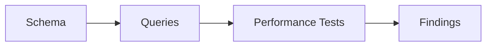

# 🎓 SQL Server Performance Lab

**Learn SQL query optimization through hands-on exercises with measurable results.**

This lab contains 750,000+ rows of test data and 6 real-world performance scenarios. Run the "bad" queries, analyze them, apply fixes, and see the improvement.

---

## 📋 What You'll Learn

| Module | Topic | What You'll Master |
|--------|-------|-------------------|
| **A** | Slow Search Patterns | Why `LIKE '%text%'` kills performance |
| **B** | Covering Indexes | How to eliminate expensive Key Lookups |
| **C** | Parameter Sniffing | Why the same query runs fast AND slow |
| **D** | Deadlocks | How concurrent transactions block each other |
| **E** | Columnstore Indexes | Massive speedups for analytical queries |
| **F** | Temporal Tables | Automatic historical data tracking |

---

## 🚀 Quick Start

### Step 1: Start SQL Server

**Using Docker (Mac/Linux/Windows):**
```bash
docker-compose up -d
```

**Connection Details:**
- Server: `localhost,1433`
- Username: `sa`
- Password: `YourStrong@Pass123`

### Step 2: Create the Database

Open Azure Data Studio or SSMS and run these files **in order**:

1. `db/01-schema.sql` - Creates tables
2. `db/02-seed-data.sql` - Generates 750K+ rows (~2 minutes)
3. `db/03-indexes.sql` - Creates indexes
4. `db/04-stored-procedures.sql` - Creates helper procedures

### Step 3: Verify Setup

```sql
USE PerformanceLab;

SELECT 'Customers' AS TableName, COUNT(*) AS Rows FROM dbo.Customers
UNION ALL SELECT 'Orders', COUNT(*) FROM dbo.Orders
UNION ALL SELECT 'OrderDetails', COUNT(*) FROM dbo.OrderDetails
UNION ALL SELECT 'Products', COUNT(*) FROM dbo.Products;
```

**Expected:** ~750,000 total rows

### Step 4: Run the Tests

Execute `RUN-ALL-TESTS.sql` to verify all modules work correctly.

---

## 📂 Project Structure

```
sqlserver-performance-lab/
│
├── db/                              # Database Setup
│   ├── 01-schema.sql               # Table definitions
│   ├── 02-seed-data.sql            # Test data (750K+ rows)
│   ├── 03-indexes.sql              # Index definitions
│   └── 04-stored-procedures.sql    # Helper procedures
│
├── modules/                         # Learning Labs
│   ├── A-slow-search/              # Search pattern optimization
│   ├── B-covering-index/           # Key lookup elimination
│   ├── C-parameter-sniffing/       # Plan cache issues
│   ├── D-deadlock-demo/            # Concurrency problems
│   ├── E-columnstore-power/        # Analytical queries
│   └── F-temporal-tables/          # Historical tracking
│
├── docker-compose.yml              # One-command SQL Server setup
├── RUN-ALL-TESTS.sql               # Automated verification
└── README.md                       # This file
```

---

## 🧪 How to Use Each Module

Each module folder contains:
- `README.md` - Explains the problem and expected results
- `01-bad-query.sql` - The slow/problematic query
- `02-analysis.sql` - Why it's slow (optional)
- `03-fix.sql` - The optimized solution

### Recommended Workflow

1. **Read the README** - Understand the problem
2. **Run the bad query** - Note the logical reads and time
3. **Analyze** - Look at the execution plan
4. **Apply the fix** - Run the optimized version
5. **Compare** - See the improvement

### How to Measure Performance

Always enable statistics before running queries:

```sql
SET STATISTICS IO ON;   -- Shows logical reads
SET STATISTICS TIME ON; -- Shows execution time
```

**Key Metric:** `logical reads` - Lower is better!

---

## 📊 Expected Results

| Module | Before | After | Improvement |
|--------|--------|-------|-------------|
| A: Slow Search | ~700 reads | ~6 reads | **100x faster** |
| B: Covering Index | ~5,000 reads | ~100 reads | **50x faster** |
| E: Columnstore | ~45,000 reads | ~800 reads | **56x faster** |

---

## 🔧 Requirements

- **SQL Server 2019+** (or Azure SQL Edge for Mac)
- **Azure Data Studio** or **SSMS**
- **Docker** (optional, for easy setup)

---

## 📖 Additional Resources

- [Microsoft Docs: Query Performance](https://docs.microsoft.com/sql/relational-databases/performance/)
- [Brent Ozar: SQL Server Training](https://www.brentozar.com/)
- [SQL Server Execution Plans](https://docs.microsoft.com/sql/relational-databases/performance/execution-plans/)

---

**Happy Learning! 🎓**

---

<!-- codex:project-diagram:start -->

## Project Diagram



_Lab workflow from schema setup to performance investigation._

<!-- codex:project-diagram:end -->
